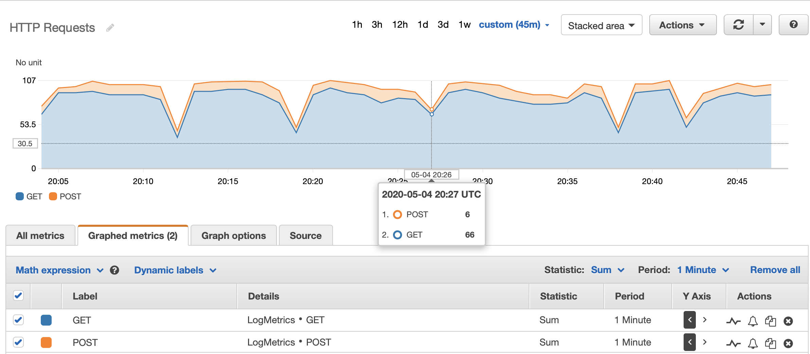
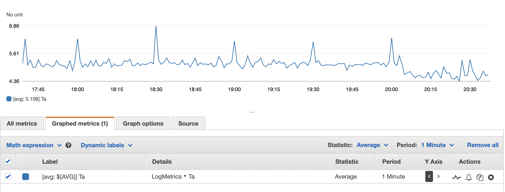
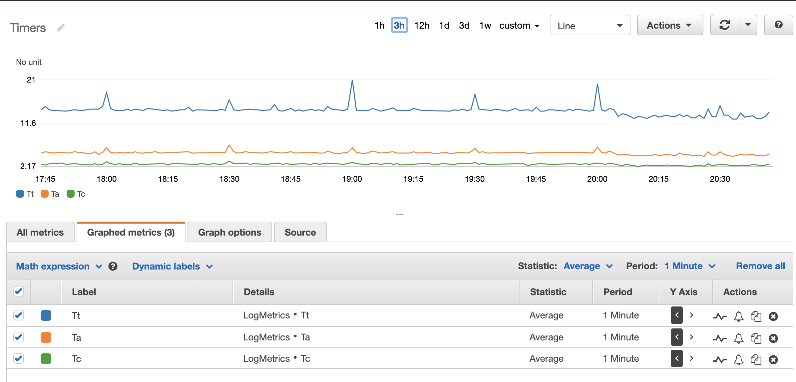
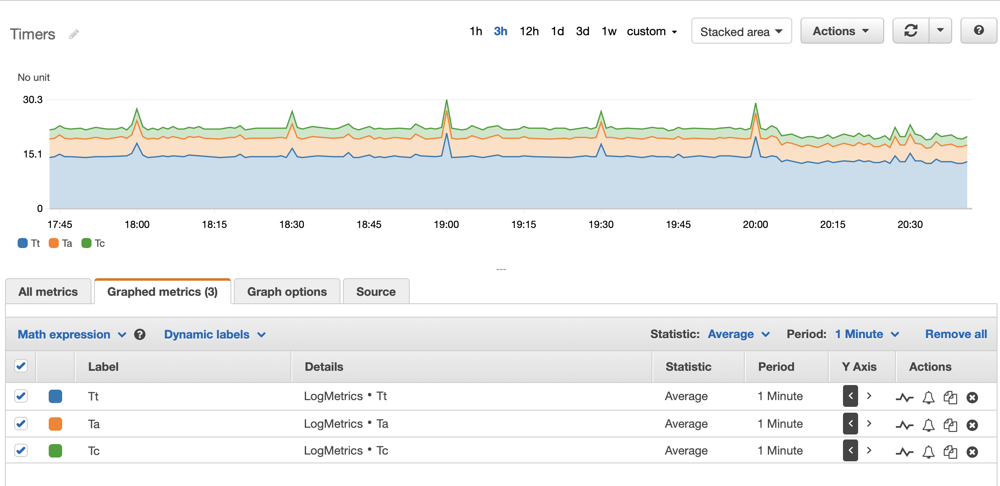

# Introduction

The goal here is to setup CloudWatch metric filters to analyze the data captured by HAProxy.

The Terraform files to create the HAProxy server along with some backends and clients for testing can be found in the previous [repo](https://github.com/salimchehab/terraform-aws-haproxy-ssl-tls-bridging). 
 
# Custom JSON Log Format for HAProxy

A custom JSON log format will be introduced here to take advantage of the querying syntax provided for JSON objects by CloudWatch.
 
Note that in this scenario HAProxy is being used in HTTP mode (`mode http`) which allows access to the HTTP specific variables such as request method, status code, etc.

The default HTTP format is defined this way:
```text
log-format "%ci:%cp [%tr] %ft %b/%s %TR/%Tw/%Tc/%Tr/%Ta %ST %B %CC %CS %tsc %ac/%fc/%bc/%sc/%rc %sq/%bq %hr %hs %{+Q}r"
```

The HAProxy log file format will be changed to JSON format by specifying the following `log-format` options (nicely formatted [here](./haproxy-log-format.json)):
```text
log-format '{"backend":{"name":"%b","concurrent_connections":%bc,"source_ip":"%bi","source_port":%bp,"queue":%bq},"bytes":{"read":%B,"uploaded":%U},"captured_headers":{"request":"%hr","response":"%hs"},"client":{"ip":"%ci","port":%cp},"cookie_captured":{"request":"%CC","response":"%CS"},"datetime":{"accept_date_milliseconds":%ms,"GMT":"%T","local":"%Tl","millisecond_resolution":"%t","GMT_start_of_HTTP_request":"%trg","local_start_of_HTTP_request":"%trl","timestamp":%Ts},"frontend":{"name":"%f","concurrent_connections":%fc,"ip":"%fi","port":%fp,"name_transport":"%ft","log_counter":%lc},"hostname":"%H","http":{"method":"%HM","request_uri_without_query_string":"%HP","request_uri_query_string":"%HQ","request_uri":"%HU","version":"%HV","unique_ID":"%ID","status_code":%ST,"request":"%r"},"number_of_retries":%rc,"pid":%pid,"process_concurrent_connections":%ac,"request_counter":%rt,"server":{"name":"%s","concurrent_connections":%sc,"ip":"%si","port":%sp,"queue":%sq},"ssl":{"cipher_used":"%sslc","version":"%sslv"},"termination":{"state":"%ts","state_with_cookie_status":"%tsc"},"timers":{"tr":"%tr","Ta":%Ta,"Tc":%Tc,"Td":%Td,"Th":%Th,"Ti":%Ti,"Tq":%Tq,"TR":%TR,"Tr":%Tr,"Tt":%Tt,"Tw":%Tw}}'
```

All the defined variables are captured in the above specified custom JSON log except for `hrl` and `hsl` which are represented by `hl` and `hs` respectively.  

In addition, all the logged values are of type string except the following which are numeric (as specified in the HAProxy manual) to facilitate numeric operations on the queries (such as >=, <, =, etc.):
```text
%bc, %bp, %bq, %B, %U, %cp, %ms, %Ts, %fc, %fp, %lc, %ST, %rc, %pid, %ac, %rt, %sc, %sp, %sq, %Ta, %Tc, %Td, %Th, %Ti, %Tq, %TR, %Tr, %Tt, %Tw
```

Since the JSON output could exceed the default allowed log length of 1024 characters, make sure the the `haproxy.cfg` file adjusts the `len` parameter as follows (example with 4096 chars allowed):
```text
global
    log /dev/log len 4096 local0
    log /dev/log len 4096 local1 notice
``` 

# IAM Role for EC2 Instances (Allow CloudWatch LogGroup Access) 

**Note**: costs can be incurred when transferring data to CloudWatch. Use the following sections wisely!

In order to allow the EC2 instances to upload the HAProxy log file to CloudWatch, the following policy should be attached to the IAM role:
```json
{
  "Version": "2012-10-17",
  "Statement": [
    {
      "Effect": "Allow",
      "Action": [
        "logs:CreateLogGroup",
        "logs:CreateLogStream",
        "logs:PutLogEvents",
        "logs:DescribeLogStreams"
    ],
      "Resource": [
        "*"
    ]
  }
 ]
}
```

# CloudWatch Log Groups and Metric Filters

The CloudWatch Log Group `/var/log/haproxy.log` contains a Log Stream with the instance id (e.g. i-0405c293e05d0f5be).

## Example Log Event

```text
May  4 20:23:01 ip-172-31-18-251 haproxy[14280]: 
```
```json
{
    "backend": {
        "name": "flask_app",
        "concurrent_connections": 0,
        "source_ip": "172.31.18.251",
        "source_port": 52094,
        "queue": 0
    },
    "bytes": {
        "read": 212,
        "uploaded": 125
    },
    "captured_headers": {
        "request": "{}",
        "response": "{}"
    },
    "client": {
        "ip": "172.31.13.247",
        "port": 36530
    },
    "cookie_captured": {
        "request": "-",
        "response": "-"
    },
    "datetime": {
        "accept_date_milliseconds": 529,
        "GMT": "04/May/2020:20:23:01 +0000",
        "local": "04/May/2020:20:23:01 +0000",
        "millisecond_resolution": "04/May/2020:20:23:01.529",
        "GMT_start_of_HTTP_request": "04/May/2020:20:23:01 +0000",
        "local_start_of_HTTP_request": "04/May/2020:20:23:01 +0000",
        "timestamp": 1588623781
    },
    "frontend": {
        "name": "https-in",
        "concurrent_connections": 1,
        "ip": "172.31.18.251",
        "port": 443,
        "name_transport": "https-in~",
        "log_counter": 16967
    },
    "hostname": "ip-172-31-18-251",
    "http": {
        "method": "GET",
        "request_uri_without_query_string": "/rest/user",
        "request_uri_query_string": "",
        "request_uri": "/rest/user",
        "version": "HTTP/1.1",
        "unique_ID": "-",
        "status_code": 200,
        "request": "GET /rest/user HTTP/1.1"
    },
    "number_of_retries": 0,
    "pid": 14280,
    "process_concurrent_connections": 1,
    "request_counter": 33934,
    "server": {
        "name": "flask",
        "concurrent_connections": 0,
        "ip": "172.31.36.108",
        "port": 8052,
        "queue": 0
    },
    "ssl": {
        "cipher_used": "TLS_AES_256_GCM_SHA384",
        "version": "TLSv1.3"
    },
    "termination": {
        "state": "--",
        "state_with_cookie_status": "----"
    },
    "timers": {
        "tr": "04/May/2020:20:23:01.538",
        "Ta": 5,
        "Tc": 3,
        "Td": 0,
        "Th": 9,
        "Ti": 0,
        "Tq": 9,
        "TR": 0,
        "Tr": 2,
        "Tt": 14,
        "Tw": 0
    }
}
```

## Defined Variables

A list of defined variables that can be captured along with their types are found in the [HAProxy Configuration Manual](https://cbonte.github.io/haproxy-dconv/2.0/configuration.html#8.2.3).

They are listed [here](./variables.md) for convenience.

### Timers

Timings events in HTTP mode:
```text
                 first request               2nd request
      |<-------------------------------->|<-------------- ...
      t         tr                       t    tr ...
   ---|----|----|----|----|----|----|----|----|--
      : Th   Ti   TR   Tw   Tc   Tr   Td : Ti   ...
      :<---- Tq ---->:                   :
      :<-------------- Tt -------------->:
                :<--------- Ta --------->:
```

## CloudWatch Metric Filters

Review the AWS documentation on [Filter and Pattern Syntax](https://docs.aws.amazon.com/AmazonCloudWatch/latest/logs/FilterAndPatternSyntax.html) in order to search through the log stream. 
[Creating Metric Filters](https://docs.aws.amazon.com/AmazonCloudWatch/latest/logs/Counting404Responses.html) provides a good starting point on this topic as well.

The Terraform resources `aws_cloudwatch_log_group` and `aws_cloudwatch_log_metric_filter` are used to create log groups and metric filters respectively.

Below are some metric filters that were used (graphs shown in section below) by taking advantage of the newly formatted JSON HAProxy log: 

- Number of GET HTTP requests 
```text
{ $.http.method = "GET" }
```

- Number of POST HTTP requests 
```text
{ $.http.method = "POST" }
```

- Total active time for HTTP requests (metric value would be assigned as `$.timers.Ta`) 
```text
{ $.timers.Ta = * }
```

Similarly, one can compose as many as needed such as:

- Number of HTTP requests with total active time > 6ms  
```text
{ $.timers.Ta > 6 }
```

- Number of HTTP requests with total bytes uploaded > 100  
```text
{ $.bytes.uploaded > 100 }
```

- Number of HTTP requests coming from internal IP addresses  
```text
{ ($.client.ip = "172.*" ||  $.client.ip = "10.*") }
```

Etc.

## CloudWatch Graphed Metrics

- Stacked graph of GET and POST HTTP requests:



- Line graph of time of active HTTP requests:



- Line graph of timers:



- Stacked graph of timers:


